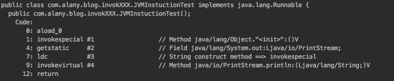
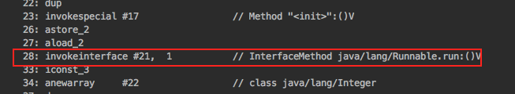

JVM指令之 invokestatic,invokespecial,invokeinterface,invokevirtual,invokedynamic
====

## 虚拟机指令说明
指令|说明
---|---
invokeinterface	| 用以调用接口方法，在运行时搜索一个实现了这个接口方法的对象，找出适合的方法进行调用。（Invoke interface method）
invokevirtual	|指令用于调用对象的实例方法，根据对象的实际类型进行分派（Invoke instance method; dispatch based on class）
invokestatic	|用以调用类方法（Invoke a class (static) method ）
invokespecial	|指令用于调用一些需要特殊处理的实例方法，包括实例初始化方法、私有方法和父类方法。（Invoke instance method; special handling for superclass, private, and instance initialization method invocations ）
invokedynamic	|JDK1.7新加入的一个虚拟机指令，相比于之前的四条指令，他们的分派逻辑都是固化在JVM内部，而invokedynamic则用于处理新的方法分派：它允许应用级别的代码来确定执行哪一个方法调用，只有在调用要执行的时候，才会进行这种判断,从而达到动态语言的支持。(Invoke dynamic method)


## 示例代码
接下来我们通过一段代码说明一下上面的虚拟机指令的运用。

``` java
public class JVMInstuctionTest implements Runnable {

    public JVMInstuctionTest() {
        System.out.println("construct method ==> invokespecial");
    }

    private void invokeSpecialMethod() {
        System.out.println("private method ==> invokespecial");
    }

    void invokeVirtualMethod() {
        System.out.println("instance method ==> invokevirtual");
    }

    static void invokeStaticMethod() {
        System.out.println("static method ==> invokestatic");
    }

    @Override
    public void run() {
        System.out.println("invokeinterface method");
    }

    public static void main(String[] args) {
        // 使用 invoke 指令
        /**
         * invokespecial
         */
        JVMInstuctionTest test = new JVMInstuctionTest();
        /**
         * invokespecial
         */
        test.invokeSpecialMethod();
        /**
         * invokevirtual
         */
        test.invokeVirtualMethod();
        /**
         * invokestatic
         */
        invokeStaticMethod();
        /**
         * invokeinterface
         */
        Runnable runnable = new JVMInstuctionTest();
        runnable.run();
        /**
         * invokedynamic
         * Java 8中，lambda表达式和默认方法时，底层会生成和使用invoke dynamic
         */
        List<Integer> list = Arrays.asList(1, 2, 3);
        list.stream().forEach(System.out::println);
    }
}
```

## 查看使用虚拟机指令字节码文件

我们使用javap来反编译生成的class文件，首先看构造方法，编译器生成的字节码中是什么指令：


- JVMInstuctionTest test = new JVMInstuctionTest();

<div align="center">  </div><br>

从上面我们可以看到，构造方法，invokespecial指令。

- invokeSpecialMethod() 是类的私有实例方法，也是生成 invokespecial 指令
- invokeVirtualMethod() 是实例方法，应为 invokespecial 指令
-  invokeStaticMethod() 为静态方法，应为 invokestaticMethod 指令

<div align="center">  </div><br>

- 测试类实现了 Runnable 接口，所以对于代码

``` java
Runnable runnable = new JVMInstuctionTest();
        runnable.run();
```
        
其对应生成的指令应为invokeinterface，反编译结果如下：

<div align="center">  </div><br>

- 对于Lambda表达式，在Java 8中Lambda表达式和默认方法时，底层会生成和使用invokedynamic

    list.stream().forEach(System.out::println);

我们可以看到生成的指令代码使用了 invokedynamic ：

<div align="center">  </div><br>

## 使用MethodHandle

``` java
        // 使用 MethodHandle
        /**
         * invokedynamic
         */
        MethodHandles.Lookup lookup = MethodHandles.lookup();
        MethodHandle mh = lookup.findVirtual(JVMInstuctionTest.class,
                "methodHandle",
                MethodType.methodType(void.class,String.class));
        System.out.println(mh);
        mh.bindTo(test).invoke("no static string");

        mh = lookup.findStatic(JVMInstuctionTest.class,
                "staticMethodHandle",
                MethodType.methodType(void.class,String.class));
        mh.invoke("static string");
```

## MethodHandle VS Reflect

``` java
        // II.使用 MethodHandle
        /**
         * invokedynamic
         */
        MethodHandles.Lookup lookup = MethodHandles.lookup();
        MethodHandle mh = lookup.findVirtual(JVMInstuctionTest.class,
                "methodHandle",
                MethodType.methodType(void.class,String.class));
        System.out.println(mh);
        mh.bindTo(test).invoke("no static string");

        mh = lookup.findStatic(JVMInstuctionTest.class,
                "staticMethodHandle",
                MethodType.methodType(void.class,String.class));
        mh.invoke("static string");
        System.out.println("==============");

        // III.使用 reflect
        Class clazz = Class.forName("com.alany.blog.invokXXX.JVMInstuctionTest");
        Object obj = clazz.newInstance();
        Method method = clazz.getMethod("methodHandle",String.class);
        method.invoke(obj,"aaa");
```

以下来自《深入Java虚拟机》:

- 从Java语言的角度来看，MethodHandle的使用方法和效果与反射有众多相似之处，不过，他们还是有以下区别：

- 反射中的java.lang.reflect.Method对象远比MethodHandle机制中的java.lang.invoke.MethodHandle对象所包含的信息多。前者是方法在Java一端的全面映像，包含了方法的签名、描述符以及方法属性表中各种属性的Java端表示方式，还包含执行权限等运行信息。而后者仅仅包含了于执行该方法相关的信息。用通俗的话来讲，反射是重量级的，而MethodHandle是轻量级。

- 由于MethodHandle是对字节码的指令调用模拟，所以理论上虚拟机在这方面做的各种优化（如方法内联），在MethodHandle上也应当可以采用类似的思路去支持。而通过反射去调用方法则不行。

- 最关键的一点还在于：反射API设计目标只是为了Java语言服务的，而MethodHandle则设计成可服务于所有Java虚拟机上的语言，其中也包含Java语言。


## invokedynamic指令

在某种程度上，invokedynamic指令与MethodHandle机制的作用是一样的，都是为了解决原有4条指令方法分派规则固化在虚拟机之中的问题，把如何查找目标方法的决定权从虚拟机转嫁到具体用户代码中，让用户有更高的自由度。而且，他们两者的思路也是可类比的，可以把他们想象成为了达成同一个目的，一个采用上层Java代码和API来实现，另一个用字节码和Class中其他属性、常量来完成。