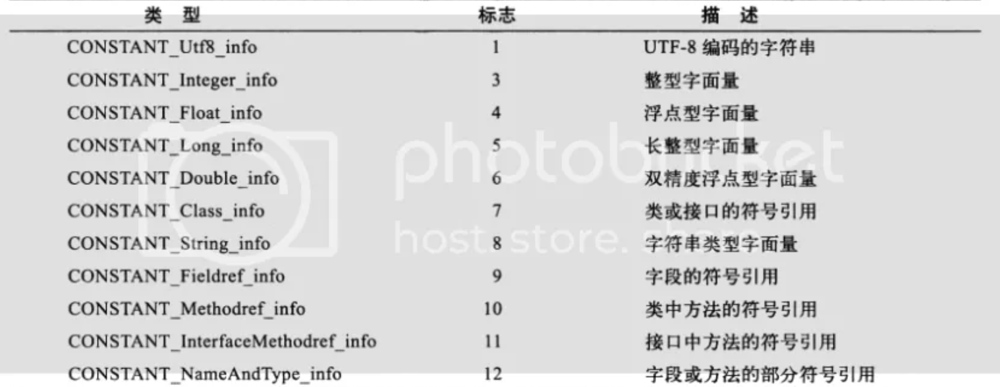
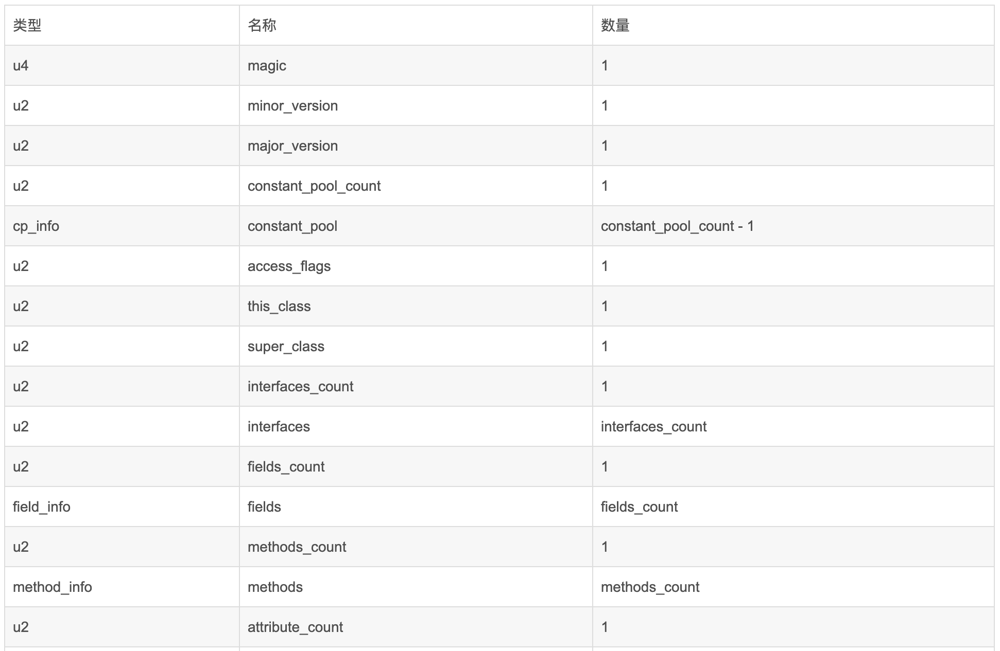
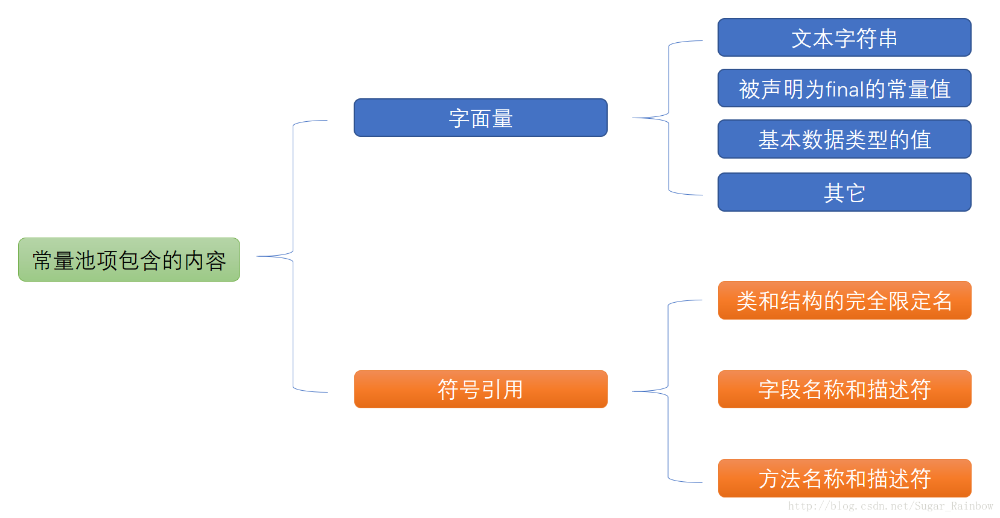
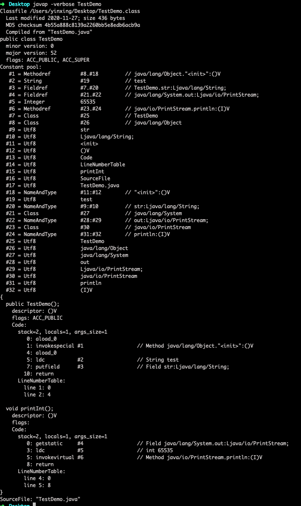

方法区-字符串常量池、class常量池和运行时常量池
====

# 主题1 | 全局字符串池、class文件常量池、运行时常量池

## 1.全局字符串池（string pool 也叫做 string literal pool）

全局字符串池里的内容在类加载阶段完成，经过验证，**准备阶段之后在堆中生成字符串对象实例，然后将该字符串对象实例的引用值存到string pool中**。

⚠️这里提醒你一下，string pool中存的是**引用值**而不是具体的实例对象，**具体实例对象是在堆中开辟一块空间存放**。 

在 HotSpot VM 里实现的 string pool 功能的是一个 **`StringTable`** 类，它是一个哈希表，里面存的是驻留字符串的引用（即双引号括起来的，而不是驻留字符串实例本身），也就是说在堆中的某些字符串实例被这个 StringTable 引用之后就等同于被赋予了”驻留字符串”的身份。**StringTable 在每个 HotSpot VM 的实例只有一份，被所有的类共享**。

## 2.class文件常量池（class constant pool）

我们知道，class 文件中除了包含类的版本、字段、方法、接口等描述信息外，还有一项信息就是**`常量池(constant pool table)`**，用于存放编译器生成的各种**`字面量(Literal)`**和**`符号引用(Symbolic References)`**。 

* 字面量，即常量的概念，如字符串、被声明为final的基本数据类型等。 

* 符号引用是一组符号来描述所引用的目标，符号可以是任何形式的字面量，只要能无歧义地定位到目标即可（注意区分直接引用，**直接引用一般是指向方法区的本地指针，相对偏移量或是一个能间接定位到目标的句柄**）。

	符号引用一般包括下面三类常量：

	* 类和接口的全限定名
	
	* 字段的名称和描述符
	
	* 方法的名称和描述符

常量池的每一项常量都是一个表，一共有 11 种表结构数据。每个表开始的第一位都是一个字节的标志位（取值1-12），代表当前常量属于哪种常量类型，为了方便你查看，如下表所示。

<div align="center">  </div><br>

> 每种不同类型的常量类型具有不同的结构，具体结构就不叙述了，如果你想深入了解每种常量类型的数据结构可以查看《深入理解java虚拟机》第六章相关内容。

## 3.运行时常量池（runtime constant pool）

**当 java 文件被编译成 class 文件之后，就会生成 class常量池**，那么运行时常量池又是什么时候产生的呢？

jvm 在执行某个类时，必须经过加载、连接、初始化，而连接又包括验证、准备、解析三个阶段。而**当类加载到内存后， jvm 就会将 class常量池中的内容放到运行时常量池中，由此可知，运行时常量池是每个类都有一个**。

在上面我们也说了，class常量池中存的是字面量和符号引用，即存的不是对象的实例，而是对象的符号引用值。而经过解析（resolve）之后，也就是把符号引用替换为直接引用，解析的过程会查询全局字符串池，也就是 StringTable，以保证运行时常量池所引用的字符串与全局字符串池中所引用的是一致的。

> 我们举个例子来解释一下:
> 
> ```java
> public class HelloWorld {
>     public static void main(String []args) {
> 		String str1 = "abc"; 
> 		String str2 = new String("def"); 
> 		String str3 = "abc"; 
> 		String str4 = str2.intern(); 
> 		String str5 = "def"; 
> 		System.out.println(str1 == str3);//true 
> 		System.out.println(str2 == str4);//false 
> 		System.out.println(str4 == str5);//true
>     }
> }
> ```

参考上面的程序，很容易解释整个程序的内存分配过程了：

> 首先，在堆中会有一个”abc”实例，全局 StringTable 中存放着 ”abc” 的一个引用值。
> 
> 然后**在运行第二句会生成两个实例**，一个是”def”的实例对象，并且 StringTable 中存储一个”def”的引用值，**还有一个是 new 出来的一个”def”的实例对象**(注意这是一个新实例)，与前面那个是不同的实例。
> 
> 当在解析 str3 的时候查找 StringTable，里面有 ”abc” 的全局驻留字符串引用，所以 str3 的引用地址与之前的 “abc" 实例相同。
> 
> str4 是在运行的时候调用 intern() 函数，返回 StringTable 中 ”def” 的引用值，如果没有就将 str2 的引用值加进去，在这里，StringTable 中已经有了 ”def” 的引用值了，所以返回上面在 new str2 时添加到 StringTable 中的 “def” 引用值。
> 
> 最后 str5 在解析时也是指向存在于 StringTable 中的 ”def” 的引用值。
> 
> 因此，你也就能理解下面三个打印的值了。

上面的程序首先经过编译之后，在该类的 class 常量池中存放一些符号引用，然后**类加载之后，将 class 常量池中存放的符号引用转存到运行时常量池中**，然后**经过验证，准备阶段之后，在堆中生成驻留字符串的实例对象（即 str1 所指向的”abc”实例对象），然后将这个对象的引用存到全局 String Pool(即 StringTable)中**，最后**在解析阶段，要把运行时常量池中的符号引用替换成直接引用**，那么就直接查询 StringTable ，保证 StringTable 里的引用值与运行时常量池中的引用值一致，以上就是整个类的处理过程。

## 小结

* 1.**全局常量池在每个 VM 中只有一份，存放的是字符串常量的引用值**。

* 2.**class 常量池是在编译的时候每个 class 都有的**，在编译阶段，存放的是常量的符号引用。

* 3.运行时常量池是在类加载完成之后，将每个class常量池中的符号引用值转存到运行时常量池中，也就是说，每**个class都有一个运行时常量池，类在解析之后，将符号引用替换成直接引用**，与全局常量池中的引用值保持一致。

-----------

# 主题2 | class文件常量池和运行时常量池详解

首先，让我们思考几个问题。

1. 方法区里面存着什么东西？

2. 方法区里保存的 class 文件信息和 class文件常量池是什么关系？

3. class文件常量池和运行时常量池是什么关系？

> 接下来，就让我为你逐一解答这些问题。

我们知道，方法区存着类的信息，常量和静态变量，即类被编译后的数据。这个说法没有问题，只是太笼统了。更详细一点的说法是方法区里存放着类的版本，字段，方法，接口和常量池。常量池里存储着字面量和符号引用。

> 符号引用包括：1.类的全限定名，2.字段名和属性，3.方法名和属性。

下面一张图展示了方法区中 class文件信息，class文件常量池和运行时常量池的关系。

<div align="center">  </div><br>

下面这张图展示了方法区中 class文件信息包含了哪些内容。

<div align="center">  </div><br>

可以看到在方法区里的 class文件信息包括：魔数，版本号，常量池，类，父类和接口数组，字段，方法等信息。其实类里面又包括字段和方法的信息。

下面这张表梳理了 class文件中存储的数据类型。

<div align="center">  </div><br>

我们继续用一张图来表示常量池里存储的内容。

<div align="center">  </div><br>

为了方便你理解，我们举个例子说明下。

> 我们先创建一个 java 文件，代码如下。
> 
> ```java
> public class TestDemo {    
>     private String str = "test";    
>     void printInt(){    
>         System.out.println(65535);    
>     }    
> }   
> ```
> 
> 然后用 javac 编译成 class 文件,命令如下。
> 
> 		javac TestDemo.java
> 
> 然后用 javap 反编译得到 class 文件，如下。
> 
> 		javap -verbose TestDemo
> 
> <div align="center">  </div><br>

可以看出被反编译的 class文件中的内容对应了上面解释的内容，这就解答了class文件和 class文件常量池的关系。

### class文件常量池和运行时常量池的关系以及区别

* class 文件常量池存储的是当 class 文件被 java 虚拟机加载进来后存放在方法区的一些**字面量和符号引用**。

* 运行时常量池是当 class 文件被加载完成后，java 虚拟机会将 class 文件常量池里的内容转移到运行时常量池里，在 class文件常量池的符号引用有一部分是会被转变为直接引用的，比如**类的静态方法或私有方法，实例构造方法，父类方法，这是因为这些方法不能被重写其他版本**，所以在加载的时候就可以将符号引用转变为直接引用，而其他的一些方法是在这个方法被第一次调用的时候才会将符号引用转变为直接引用的。

## 小结

方法区里存储着 class 文件的信息和运行时常量池, class 文件的信息包括类信息和 class 文件常量池。

运行时常量池里除了 class 文件常量池内容外，还**将 class 文件常量池里的符号引用转变为直接引**用，而且运行时常量池里的内容是**能动态添加**。

> 例如调用 String 的 intern 方法就能将 string 的值添加到 String 常量池中。⚠️提醒你一下，这里 String 常量池是包含在运行时常量池里的，但在 jdk1.8 后，String 常量池北放到了堆中。

### 参考链接

* https://blog.csdn.net/qq_26222859/article/details/73135660

* http://blog.csdn.net/vegetable_bird_001/article/details/51278339

* https://www.cnblogs.com/holos/p/6603379.html